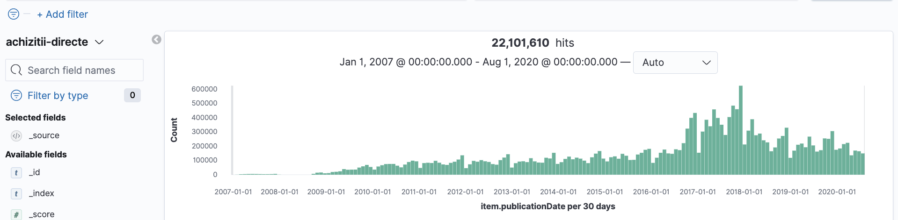
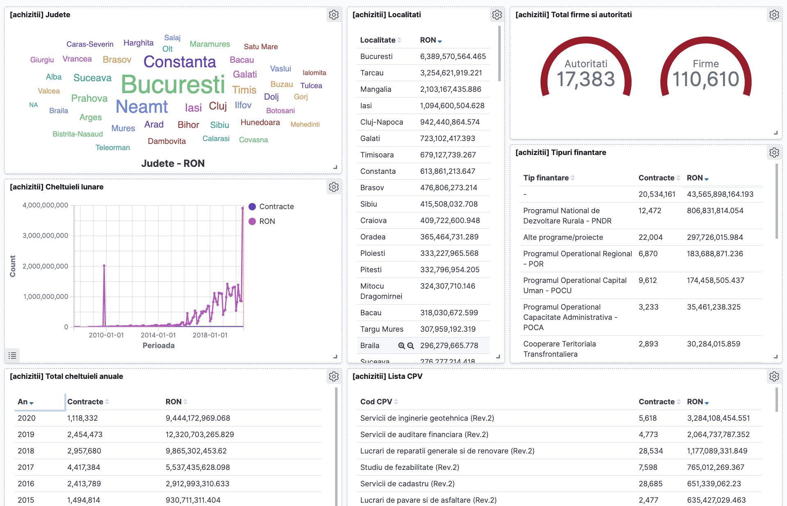
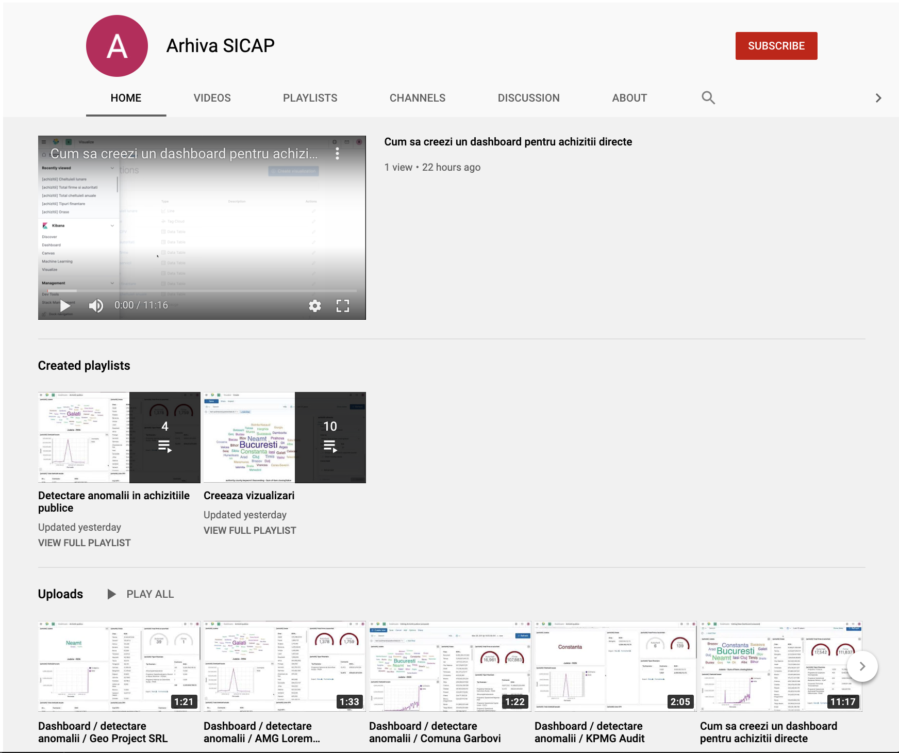

# sicap-explorer

**sicap-explorer** este un tablou de vizualizare a licitatiilor publice si achizitiilor directe cu ajutorul aplicatiei open-source [Kibana](https://www.elastic.co/kibana)

Datele sunt preluate din portalul de licitatii publice SEAP/SICAP în baza **Licenței pentru Guvernare Deschisa v1.0**

Seturile de date contin **22,055,794 achizitii directe** si **468,164 licitatii publice** incepand cu anul 2007 pana in data de 31 iulie 2020

Cateva exemple cu tabloul in actiune pe canalul de [YouTube](https://www.youtube.com/channel/UCLmNkO-z3KeZDYmkp-u2u_Q/featured):

## Cum se instaleaza pe masina proprie

Cerinte minime pentru o functionare de baza

- 100gb liberi pe disc
- 4 core / 8gb ram
- Sistem de operare: Windows / MacOS / Linux

<u>Cerinte recomandate</u>

- 100 gb liberi pe disc
- 8 core / 16gb ram
- Sistem de operare: MacOS / Linux

**Pasul 1:**

Descarca arhiva SICAP folosind [link-ul torrent]().

**Pasul 2:**

Instaleaza [Elasticsearch](https://www.elastic.co/guide/en/elasticsearch/reference/current/install-elasticsearch.html) si [Kibana](https://www.elastic.co/guide/en/kibana/current/install.html) pentru sistemul de operare folosit.

Alternativ se poate instala si folosid [Docker](https://docs.docker.com/engine/install/) folosid fisierul de [configurare](docker/docker-compose.yml).

**Pasul 3:**

...
