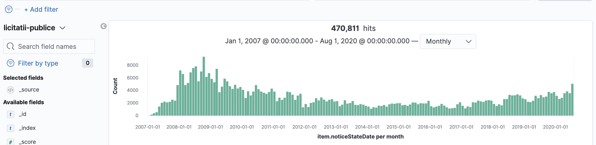

# sicap-explorer

**sicap-explorer** este un tablou de vizualizare a licitatiilor publice si achizitiilor directe cu ajutorul aplicatiei open-source [Kibana](https://www.elastic.co/kibana)

Seturile de date contin **22,101,610 achizitii directe** si **470,811 licitatii publice** incepand cu anul 2007 pana in data de 31 iulie 2020

Datele sunt preluate din portalul de licitatii publice SEAP/SICAP în baza **Licenței pentru Guvernare Deschisa v1.0** folosind utilitarul **[sicap-parser](https://github.com/arhiva-sicap/sicap-parser)**


[](#)

[](#)

[](#)

Cateva exemple cu tabloul in actiune pe canalul de [YouTube](https://www.youtube.com/channel/UCLmNkO-z3KeZDYmkp-u2u_Q/featured):

[](https://www.youtube.com/channel/UCLmNkO-z3KeZDYmkp-u2u_Q/featured)

## Cum se instaleaza pe masina proprie

Cerinte minime pentru o functionare de baza

- 100gb liberi pe disc
- 4 core / 8gb ram
- Sistem de operare: Windows / MacOS / Linux

<u>Cerinte recomandate</u>

- 100 gb liberi pe disc
- 8 core / 16gb ram
- Sistem de operare: MacOS / Linux

**Pasul 1:**

Descarca arhiva SICAP folosind [link-ul torrent](arhiva-sicap.torrent).

**Pasul 2:**

Instaleaza [Elasticsearch](https://www.elastic.co/guide/en/elasticsearch/reference/current/install-elasticsearch.html) si [Kibana](https://www.elastic.co/guide/en/kibana/current/install.html) pentru sistemul de operare folosit.

Alternativ se poate instala si folosid [Docker](https://docs.docker.com/engine/install/) folosid fisierul de configurare [docker-compose.yml](docker/docker-compose.yml).

**Pasul 3:**

Verifica daca totul este instalat si Kibana porneste la adresa http://localhost:5601

In functie de ce sistem de operare ai, gaseste fisierul **elasticsearch.yml** si adauga urmatoarea linie reprezentand locatia pe disc a arhivei snapshot descarcata de pe torent

```
path.repo: /folder/backup
```

Dezarhiveaza arhiva in folderul de mai sus si incepe procesul de "restore" din Kibana.

Un tutorial video cum poti face asta gasesti pe canalul de YouTube [aici](https://www.youtube.com/watch?v=piD_sQH1I98)

**Nota:** 

Fisierul torrent contine urmatoarele fisiere:
```bash
 20M Aug  1 21:41 achizitii-directe-2007.json.gz
 24M Aug  1 21:41 achizitii-directe-2008.json.gz
236M Aug  1 21:43 achizitii-directe-2009.json.gz
447M Aug  1 21:47 achizitii-directe-2010.json.gz
541M Aug  1 21:50 achizitii-directe-2011.json.gz
587M Aug  1 21:54 achizitii-directe-2012.json.gz
628M Aug  1 21:59 achizitii-directe-2013.json.gz
738M Aug  1 22:05 achizitii-directe-2014.json.gz
836M Aug  1 22:11 achizitii-directe-2015.json.gz
1.3G Aug  1 22:20 achizitii-directe-2016.json.gz
2.3G Aug  1 22:35 achizitii-directe-2017.json.gz
1.9G Aug  1 22:48 achizitii-directe-2018.json.gz
1.7G Aug  1 23:02 achizitii-directe-2019.json.gz
835M Aug  1 22:33 achizitii-directe-2020.json.gz
 35G Aug  2 00:04 arhiva-sicap-elasticsearch-snapshot.tar.gz
412M Aug  1 21:35 licitatii-publice.json.gz
```

**arhiva-sicap-elasticsearch-snapshot.tar.gz** contine informatiile necesare procesului de restore in Elasticsearch. Se dezarhiveaza ocupand aproximativ 50gb. Durata totala de restore este aproximativ 20-30 minute, in functie de puterea procesorului.

Celelalte fisiere sunt arhivele cu informatiile defalcate pe ani  in format json. Se pot indexa cu ajutorul utilitarului [elasticdump](https://github.com/elasticsearch-dump/elasticsearch-dump)

```bash
elasticdump \
  --input=http://localhost:9200/licitatii-publice \
  --output=./licitatii-publice.json \
  --limit=10000 \
  --concurrency=200
```

*Durata totala a importarii documentelor json este de 4-8 ore, in functie de puterea procesorului.*

**Pasul 4:**

Importa [dashboardul](dashboards/achizitii-directe.json) in Kibana

```
$ curl -H "Content-Type: application/json" -d @dashboards/achizitii-directe.json -X POST http://localhost:5601/api/kibana/dashboards/import\?exclude\=index-pattern -H 'kbn-xsrf: true'
```

**Nota:**

Setarile initiale pentru Elasticsearch includ o memorie folosita de 2gb iar pentru Kibana de 1.4gb.
Este recomandat sa modifici memoria heap pentru Elasticsearch sa nu depaseasca jumatate din memoria disponibila.
Mai mult detalii [aici](https://www.elastic.co/guide/en/elasticsearch/reference/master/heap-size.html) iar pentru Kibana [aici](https://www.elastic.co/guide/en/kibana/current/production.html#memory)

Acest proiect adopta principiile [Public Money / Public Code](https://publiccode.eu/) si doreste ca institutiile publice sa ofere access catre informatiile cu caracter public intr-un mod cat mai usor.

[](https://publiccode.eu/)
